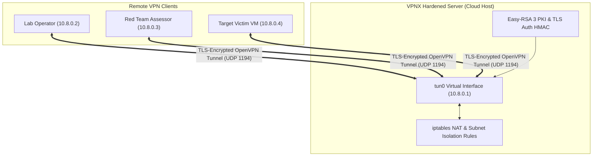

# 🛡️ VPNX — Automated Cloud OpenVPN Lab Network Deployer

[](https://python.org)
[](https://openvpn.net)
[](https://kernel.org)
[](LICENSE)

**VPNX** is a zero-dependency automated server deployment and client configuration suite designed to build private, **TryHackMe / HackTheBox-style VPN networks** on any cloud instance (AWS, DigitalOcean, Linode, Hetzner, or bare metal) in under 60 seconds.

Provisions a complete Easy-RSA Public Key Infrastructure (PKI), hardened OpenVPN daemon configurations, iptables NAT firewall routing, and self-contained `.ovpn` client profile files with embedded certificates.

---

## ⚡ Key Capabilities

- ⚡ **One-Command Zero-Touch Provisioning:** Automatically detects public IPv4 via AWS IMDSv2/v1 and cloud metadata fallbacks, generates CA and Diffie-Hellman parameters, and initializes the server daemon.
- 👥 **Dynamic Multi-Client Lifecycle:** Issues, inspects, and revokes cryptographic `.ovpn` client profiles containing embedded CA certificates, client keys, and TLS authentication tags.
- 🔐 **Isolated Lab Subnets:** Partitions teammates or competing lab participants into isolated virtual network segments using dynamic iptables access control lists.
- 🔍 **Pre-Flight Diagnostics:** Automatically verifies Linux IP forwarding (`net.ipv4.ip_forward`), kernel routing tables, firewall policies, and virtual TUN device availability (`/dev/net/tun`).
- 🎨 **Dual Operation Interfaces:** Interactive terminal interface with live status spinners, alongside headless CLI flags for automated cloud-init provisioning.

---

## 🏗️ Architecture & Topology



---

## 🚀 Quickstart

### 1. Interactive Terminal Mode
```bash
git clone https://github.com/Mr-N1ck/vpnx.git
cd vpnx
sudo python3 own-vpn.py
```

### 2. Headless Scriptable Automation
```bash
# View active server daemon & interface status
sudo python3 own-vpn.py --status

# List configured client profiles
sudo python3 own-vpn.py --list

# Run pre-flight network diagnostics
sudo python3 own-vpn.py --diagnose

# Start / Stop VPN daemon
sudo python3 own-vpn.py --start
sudo python3 own-vpn.py --stop
```

---

## 💻 CLI Options

| Flag | Description |
| :--- | :--- |
| `--status` | Display running status of OpenVPN daemon, public IP, and `tun0` interface |
| `--list` | Enumerate active client certificates and issued `.ovpn` bundles |
| `--diagnose` | Test IP forwarding, route tables, kernel modules, and firewall forwarding |
| `--start` | Start the OpenVPN daemon service |
| `--stop` | Safely terminate the OpenVPN daemon service |

---

## 🎥 Proof of Concept & Verification

> **Note:** Deployment logs, sample `.ovpn` configurations (sanitized), and terminal recordings are available in [`docs/`](docs/) and [`poc/`](poc/).

<!-- User Demo Placement Zone -->
```
[ Drop your demo.gif or demo.mp4 recording here: docs/demo.gif ]
```

---

## ⚖️ License & Security Policy

Distributed under the MIT License. Developed for authorized penetration testing infrastructure, secure CTF hosting, and private cybersecurity research networks.

**Author:** Prince Gaur ([LinkedIn](https://www.linkedin.com/in/mr-n1ck/) · [GitHub](https://github.com/Mr-N1ck))
