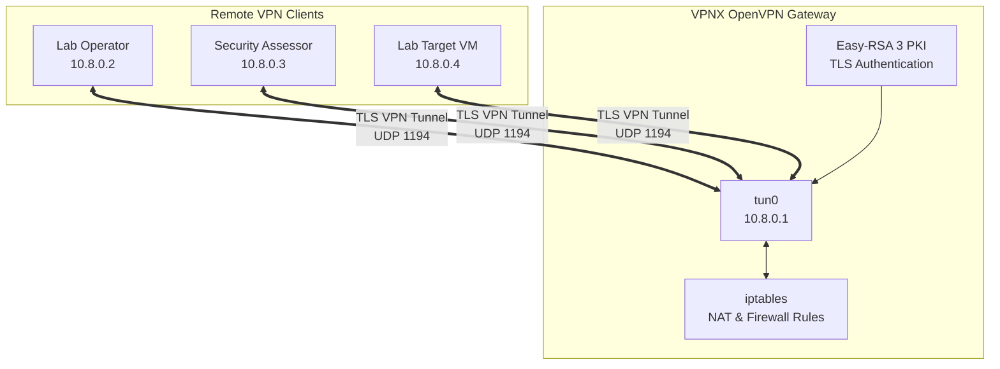
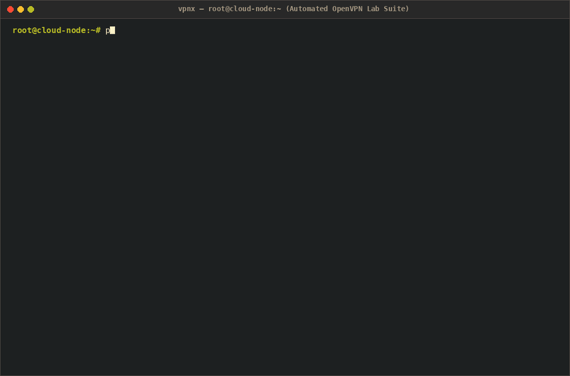

# 🛡️ VPNX — Automated Cloud OpenVPN Lab Network Deployer

<p align="center">
  
  
  
  
</p>

<p align="center">
  <b>Automated OpenVPN infrastructure for private cybersecurity labs, CTF environments, and authorized security research.</b>
</p>

---

## 📌 Overview

**VPNX** is a zero-dependency automated server deployment and client configuration suite designed to build private, **TryHackMe / Hack The Box-style VPN networks** on cloud instances or bare-metal Linux servers.

VPNX automates the deployment of:

- OpenVPN server infrastructure
- Easy-RSA Public Key Infrastructure (PKI)
- Client certificates and keys
- `.ovpn` client profiles
- TUN networking
- IP forwarding
- iptables NAT and routing
- Network diagnostics
- Client lifecycle management

The objective is to reduce the manual configuration required to create an isolated VPN-based cybersecurity laboratory.

---

## ⚡ Key Capabilities

| Capability | Description |
|---|---|
| ⚡ **Automated Provisioning** | Automatically configures the OpenVPN server and required networking components. |
| 🔐 **PKI Management** | Creates and manages the Easy-RSA certificate authority and client certificates. |
| 👥 **Multi-Client Support** | Generates, lists, and manages multiple `.ovpn` client profiles. |
| 🧱 **Network Isolation** | Supports firewall-based access control and isolated lab networking. |
| 🔍 **Pre-Flight Diagnostics** | Checks IP forwarding, routing, firewall configuration, TUN availability, and related prerequisites. |
| ☁️ **Cloud Ready** | Designed for Linux cloud instances and bare-metal lab servers. |
| 🎨 **Interactive CLI** | Provides an interactive terminal interface for common operations. |
| ⚙️ **Headless CLI** | Supports command-line operation for automated provisioning and administration. |

---

## 🏗️ Architecture & Topology



---

## 🚀 Quickstart

### 1. Interactive Terminal Mode
```bash
git clone https://github.com/Mr-N1ck/vpnx.git
cd vpnx
sudo python3 own-vpn.py
```

### 2. Headless Scriptable Automation
```bash
# View active server daemon & interface status
sudo python3 own-vpn.py --status

# List configured client profiles
sudo python3 own-vpn.py --list

# Run pre-flight network diagnostics
sudo python3 own-vpn.py --diagnose

# Start / Stop VPN daemon
sudo python3 own-vpn.py --start
sudo python3 own-vpn.py --stop
```

---

## 💻 CLI Options

| Flag | Description |
| :--- | :--- |
| `--status` | Display running status of OpenVPN daemon, public IP, and `tun0` interface |
| `--list` | Enumerate active client certificates and issued `.ovpn` bundles |
| `--diagnose` | Test IP forwarding, route tables, kernel modules, and firewall forwarding |
| `--start` | Start the OpenVPN daemon service |
| `--stop` | Safely terminate the OpenVPN daemon service |

---

## 🎥 Proof of Concept & Deployment Demonstration



### 📊 Deployment Artifacts & Previews
- **Sample Client Profile:** [`poc/sample_client.ovpn`](poc/sample_client.ovpn)
- **High-Resolution Terminal Capture:** [`docs/preview.png`](docs/preview.png)
- **High-Definition Demo Video:** [`docs/demo.mp4`](docs/demo.mp4)

---

## ⚖️ License & Security Policy

Distributed under the MIT License. Developed for authorized penetration testing infrastructure, secure CTF hosting, and private cybersecurity research networks.

**Author:** Prince Gaur ([LinkedIn](https://www.linkedin.com/in/mr-n1ck/) · [GitHub](https://github.com/Mr-N1ck))
